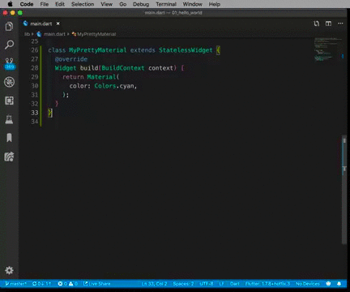

---

## Début de l'aventure !

&#x2713; Groupe Meetup ( ~= **60 membres** )

&#x2713;  Twitter  ( ~= **90 followers** )

---

## Who Am I ? 

- Boris-Wilfried : @bwnyasse

- Dart Enthusiast / Flutter Technical Trainer 

- Cloud Architect 

---

## La cible :

Faire aussi des **workshops** / **codelabs**

---

## Merci !

---

## Agenda 

1. **Episode #1 :** What's up Flutter ? 

2. **Flutter is all platform** : 
    
    **Le Beurre et l'argent du Beurre !**

    👨‍💻 Kévin Segaud ( **GDE Flutter**  )

---

## What's up Flutter ?  #1

---

###### What's up Flutter ?  #1

### Current is Dart SDK v2.5.2

- Born in October 2011 

---

###### What's up Flutter ?  #1

### [dart2native](https://dart.dev/tools/dart2native)

AOT compiling Dart programs to native, 

self-contained executables.

---

###### What's up Flutter ?  #1

### Spread Operator ...

Without Spread &#8658;

    List<Widget> americanCountries = [
        Text('USA'),
        Text('Canada')
    ];

    List<Widget> europeanCountries = [
        Text('France'),
        Text('Italy'),
        Text('Germany')
    ];

    List<Widget> asianCountries = [
        Text('India'),
        Text('China'),
    ];

    Row(
        children: americanCountries
                   ..addAll(europeanCountries)
                   ..addAll(asianCountries),
    )

---

###### What's up Flutter ?  #1

### Spread Operator ...

With Spread &#8658;

    Row(
        children: [
                ...americanCountries
                ...europeanCountries
                ...asianCountries
                ]         
    )

---

###### What's up Flutter ?  #1

### Use `if` in your Collection

With Spread &#8658;

    List<Widget> countriesToShow = [
                ...americanCountries
                ...europeanCountries
                if(isAsian)
                    ...asianCountries
    ]      

---

###### What's up Flutter ?  #1

### Who published the [package](https://pub.dev/) ?

---

###### What's up Flutter ?  #1

Do miss the [Show](https://www.youtube.com/results?search_query=%23BoringShow) !

---

###### What's up Flutter ?  #1

&#x2713; Git-based : **AWS CodeCommit**, **GitLab** ...

&#x2713;  **Build** / **Sign** / **Publish** iOS apps without a Mac

&#x2713; Test your apps on **real devices**

---

###### What's up Flutter ?  #1

VsCode is cool with Flutter Extensions

</img>

---

###### What's up Flutter ?  #1

[Supernova](https://supernova.io/features/platform-export) 

**Sketch mobile app designs** &#8658;  **native UI code**

