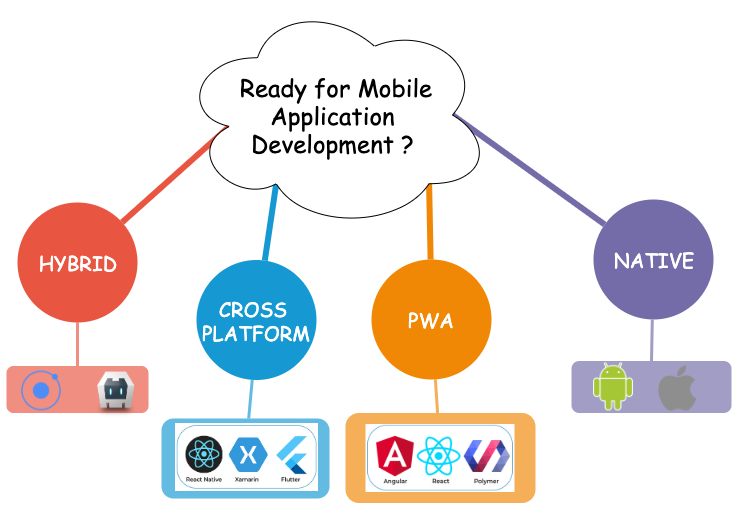

  | 
:-------------------------:|:-------------------------:
 |  

### Discover Flutter 

##### i-BP - 29/10/2019

---

### Who am I ? 

 

Boris-Wilfried : **@bwnyasse**

&#x2713; I am a **Stacker** @Stack-Labs
 
&#x2713; Just a passionate guy ....

---

### DART ... FLUTTER ?

- Have you ever heard about them ? 

- Have you ever play with them ? 

---

### Current is Dart SDK v2.5.2

- Born in October 2011 

---

### So .... Dart ? 

- Founded by **Lars Bak** & **Kasper Lund**

---

### So .... Dart ? 

 

---

### Actual State with Dart

 

---

### Mobile App development

---

#### So .... Flutter ? 

 

 

- Open Source  / 78k **stars**

- All About **Widgets** & It is all **Widgets** 

---

#### So .... Flutter ? 

 

<h6>Raise of Flutter</h6>  | <h6>Dart Developer Summit 2015</h6>
:-------------------------:|:-------------------------:
  |  

---

#### Flutter for Mobile

<h6>Same code base for IOS & Android</h6> 

---

#### Flutter for Mobile

- AOT compilation : 

        dart --> ARM & x86

- JIT compilation : 

        Hot Reload mecanism

- ~~Webviews~~ , ~~DOM~~ 

- ~~OEM widgets~~ : Original Equipement Manufacturer

---

#### Flutter for Mobile

<h6>Interaction with the platform</h6> 

---

#### Discover with Demo

- CLI 

- PUB

- Tooling

- Stateful vs Stateless

- Build Simple Application

---

#### State Management  

---

#### State Management
 

[Options](https://flutter.dev/docs/development/data-and-backend/state-mgmt/options)

- PROVIDER ( for dependency injection ... )

-  BLOC / MOBX ... 

---

#### State Management

BLOC 

 

---

##### DEMO with MOBX

---

#### Flutter for all platform 

---

#### Flutter for Web

---

#### Discover with Demo

 

- Tech Preview...

<pre>
    flutter channel master 
    flutter upgrade
</pre>

 

- Web & Desktop on Mac

<code>
<pre>
    export ENABLE_FLUTTER_DESKTOP=true
    export FLUTTER_WEB=true
</pre>
</code>

---

####  so what ? ... 

[FAQ](https://flutter.dev/docs/resources/faq)

---

##### so what ? ... 

### How big is the Flutter engine?

 

 `Center` Widget with `flutter build ...` 

 

  **APK** | **IPA** 
:-------------------------:|:-------------------------:
4.3 / 4.6 MB |  10.9MB  ~  encrypts binaries 

---

##### so what ? ... 

### 3D ( OpenGL) apps ?

 

- ~~3D via OpenGL ES or similar~~~ 

- long-term : **optimized 3D API** , **120 FPS**

---

#### The Future ... 

---

###### What's up Flutter ?  #1

&#x2713; Git-based : **AWS CodeCommit**, **GitLab** ...

&#x2713;  **Build** / **Sign** / **Publish** iOS apps without a Mac

&#x2713; Test your apps on **real devices**

---

###### What's up Flutter ?  #1

[Supernova](https://supernova.io/features/platform-export) 

**Sketch mobile app designs** &#8658;  **native UI code**

---

---

